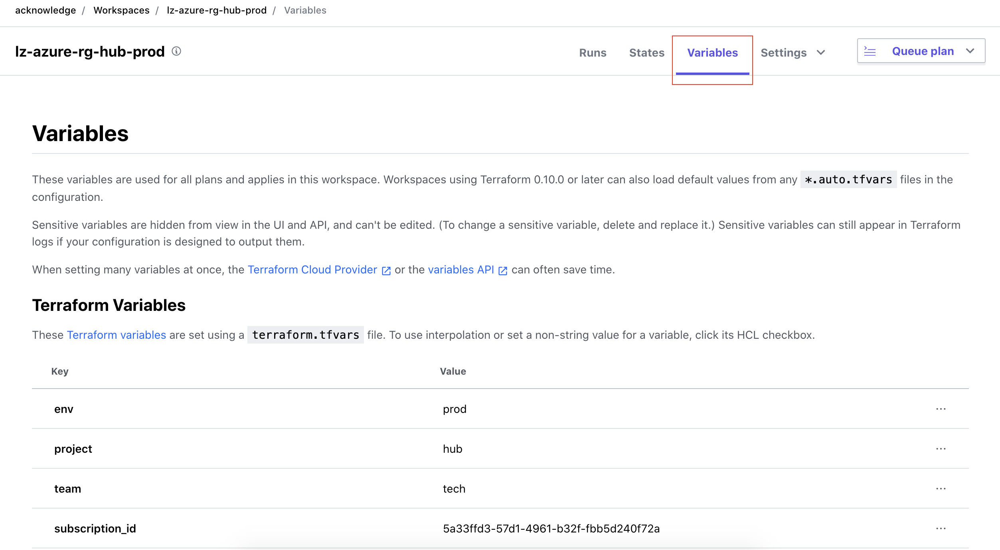

# Comment créer un nouveau groupe de ressources ? 

Le création d'un nouveau groupe de ressources passe dans un premier temps par la création d'un nouveau workspace dans Terraform Cloud.

Pour cela, une fois connecté à Terraform Cloud, accédez à la partie "Workspaces".
Vous arriverez ainsi sur une page présentant l'ensemble des workspaces provisionnés au sein de l'organisation Acknowledge : 

Cliquez ensuite sur le bouton "New workspace" pour lancer la création d'un nouveau workspace : 

Choisissez d'interfacer votre workspace avec un repository git : 

Choisissez GITLAB en tant que VCS : 

Vous devrez maintenant sélectionner le projet gitlab que vous souhaitez associer au workspace.
Pour cela, dans le filtre, tapez `lz-azure-rg`, puis sélectionnez le projet `lz-azure-rg` : 

Définissez le nom de votre workspace : 

Attention, sur ce point, respectez la convention de nommage : `lz-azure-rg-<team>-<project>-<env>`
`<env>` étant le type d'environnement que vous souhaitez déployer : 

* prod
* dev
* sandbox

A ce stade, votre workspace est créé.

Il vous reste maintenant à définir quelques variables sur votre workspace qui vous permettront ensuite de lancer la création du groupe de ressources et des composants réseaux qui va venir accueillir votre infrastructure :)

Pour créer des variables sur votre workspace, vous devrez accédez à votre workspace, puis cliquer sur le bouton "variables" : 

Vous arriverez ainsi sur une page sur laquelle vous pouvez créer des variables qui vont être consommées par le module terraform de création de groupes de ressources.

Vous devrez déclarer les variables suivantes sur votre workspace : 

> project

Soit le nom du projet ou du produit sur lequel vous voulez travailler.
A ajouter en variable Terraform.

> env

Soit le type d'environnement que vous déployez (prod, dev, sandbox).
A ajouter en variable Terraform.

> team

Soit le nom de l'équipe pour laquelle vous travaillez.
Vous pouvez saisir "tech" ou le nom du client pour lequel vous travaillez par exemple.

> subscription_id

Le nom de la subscription Azure dans laquelle vous souhaitez déployer l'infrastructure.
A ajouter en variable Terraform.

> networks

La liste des vnets et réseaux à créer dans le groupe de ressources.
Cette variable doit respecter le format suivant : `[{"vnet" : ["172.16.1.0/24"], "subnets" : ["172.16.1.0/24"]}]`

Il s'agit ici d'un exemple. Remplacez le scope du vnet et la liste des subnets parce que vous souhaitez.

> ARM_TENANT_ID

Une variable d'environnement à ajouter pour définir l'id du tenant dans lequel vous souhaitez réaliser le déploiement.

> ARM_CLIENT_ID

Une variable d'environnement à ajouter pour définir le client id à utiliser pour réaliser la configuration dans Azure.
Cette variable doit être définie comme sensible.

> ARM_CLIENT_SECRET

Une variable d'environnement à ajouter pour définir le client secret à utiliser pour réaliser la configuration dans Azure.
Cette variable doit être définie comme sensible.